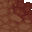
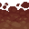
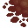
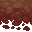
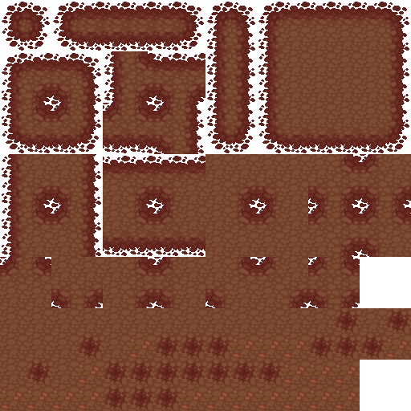
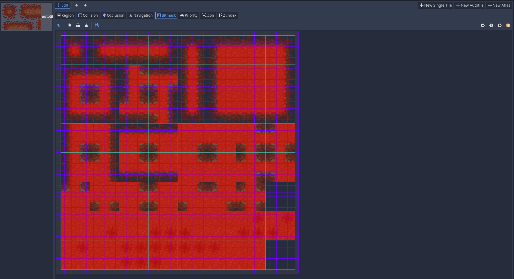

# AutotileGenerator
Generates a tilemap usable for autotiles from subtiles (e.g. in Godot)

## Generating the subtiles
We start with a small tileset including all required subtiles (inner and outer borders as well as center tile
and variations)

We cut this tileset into according subtiles and save them with the given nomenclature as single files:

_tyx_.png -> t: Inner/Outer, y: Top/Center/Bottom, x: Left/Center/Right

    I: Inner
    T: Top
    B: Bottom
    C: Center
    L: Left
    R: Right
    
Special cases are OC**0**.png and OC**i**.png for variations of the center tiles.
In the current script it's assumed that OC0.png, OC1.png and OC2.png exist.
Additionally one tile NNN.png of full transparency with according size is required.

e.g.

|  |  |
| -------- | -------- |
|  |  |
| *ITL.png* |*ITR.png* |
|  |  |
| *IBL.png* |*IBR.png* |

|  |  | |
| -------- | -------- | -------- |
|  |  |  |
| *OTL.png* |*OTC.png* | *OTR.png* |
|  |  |  |
| *OCL.png* |*OC0.png* | *OCR.png* |
|  |  |  |
| *OBL.png* |*OBC.png* | *OBR.png* |

## Running the script AutotileGenerator.py

A png is created which can be used for autotiling: 

## Godot Example

The generated png can be e.g. used with Godot's *Autotile*:

